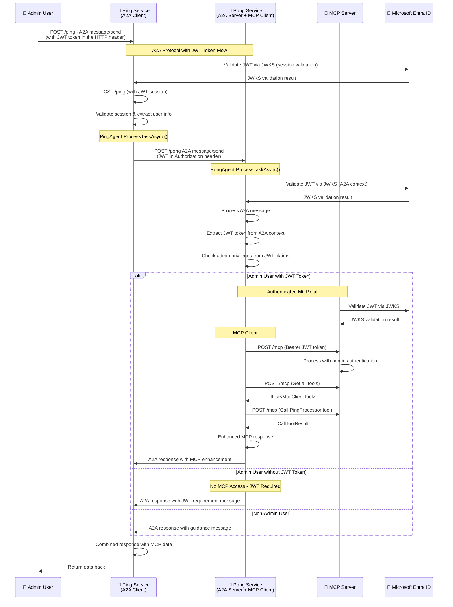

# MCP + A2A with Microsoft EntraID's Authentication and Authorization - High Level Architecture

```mermaid
sequenceDiagram
    participant User as 👤 Admin User
    participant Ping as 📡 Ping Service<br/>(A2A Client)
    participant Pong as 🏓 Pong Service<br/>(A2A Server + MCP Client)
    participant MCP as 🤖 MCP Server
    participant EntraID as 🔐 Microsoft Entra ID
    
    %% Pass JWT token to header Phase
    User->>Ping: POST /ping - A2A message/send <br>(with JWT token in the HTTP header)
    
    %% A2A Communication Phase
    Note over Ping,Pong: A2A Protocol with JWT Token Flow
    Ping->>EntraID: Validate JWT via JWKS (session validation)
    EntraID->>Ping: JWKS validation result
    Ping->>Ping: POST /ping (with JWT session)
    Ping->>Ping: Validate session & extract user info
    Note over Ping: PingAgent.ProcessTaskAsync()
    Ping->>Pong: POST /pong A2A message/send <br>(JWT in Authorization header)
    
    Note over Pong: PongAgent.ProcessTaskAsync()
    Pong->>EntraID: Validate JWT via JWKS (A2A context)
    EntraID->>Pong: JWKS validation result
    Pong->>Pong: Process A2A message
    Pong->>Pong: Extract JWT token from A2A context
    Pong->>Pong: Check admin privileges from JWT claims
    
    %% MCP Integration Branches
    alt Admin User with JWT Token
        Note over Pong,MCP: Authenticated MCP Call
        MCP->>EntraID: Validate JWT via JWKS
        EntraID->>MCP: JWKS validation result
        Note over Pong: MCP Client
        Pong->>MCP: POST /mcp (Bearer JWT token)
        MCP->>MCP: Process with admin authentication
        Pong->>MCP: POST /mcp (Get all tools)
        MCP->>Pong: IList<McpClientTool>
        Pong->>MCP: POST /mcp (Call PingProcessor tool)
        MCP->>Pong: CallToolResult
        Pong->>Pong: Enhanced MCP response
        Pong->>Ping: A2A response with MCP enhancement
    else Admin User without JWT Token
        Note over Pong: No MCP Access - JWT Required
        Pong->>Ping: A2A response with JWT requirement message
    else Non-Admin User
        Pong->>Ping: A2A response with guidance message
    end
    
    %% Response Phase
    Ping->>Ping: Combined response with MCP data
    Ping->>User: Return data back
```
