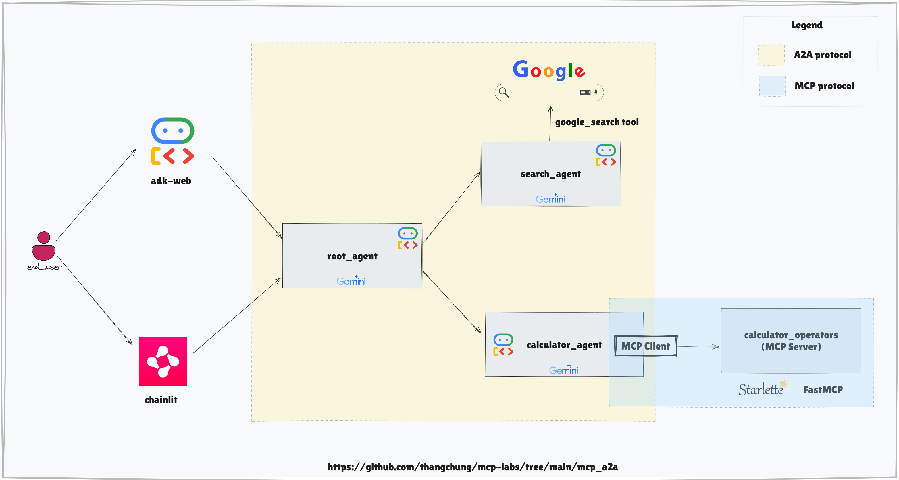

# MCP A2A - Conversational AI & Tool Orchestration

A modular AI assistant built with [Chainlit](https://www.chainlit.io/), [Google ADK](https://github.com/google/adk-python), and [Starlette](https://www.starlette.io/). This project demonstrates agent orchestration, tool integration, and conversational UI for advanced AI workflows.

---

## Features

- **Conversational AI**: Chat interface powered by Chainlit & adk-web.
- **Agent Orchestration**: The `root_agent` orchestrates sub-agents (search, calculator) using Google ADK and MCP toolset.
- **Calculator Tools**: Async math operations via MCP server (`mcp_server/calculator_tools.py`).
- **Google Search Integration**: Via Google ADK tools.
- **Session & Artifact Management**: In-memory services for session and artifact handling.

---

## High Level Architecture



## Project Structure

```
assets/                # Images and resources
main.py                # Chainlit entrypoint, agent chat logic
mcp_server/            # MCP server and calculator tools
root_agent/            # Root agent orchestration logic
pyproject.toml         # Project dependencies
uv.lock                # Lock file for reproducible builds
README.md              # This file
```

---

## Getting Started

### Prerequisites
- Python 3.12 or higher
- `uv` package manager (recommended)

### Installation

#### Using uv (Recommended)
```bash
uv sync
```

#### Using pip (Alternative)
```bash
python -m venv .venv
.venv\Scripts\activate  # On Windows
pip install chainlit google-adk mcp starlette uvicorn[standard] python-dotenv
```

---

## Running the Application

Create `.env` at root folder with content:

```env
GOOGLE_API_KEY=<your Gemini key here>
GOOGLE_GENAI_USE_VERTEXAI=FALSE
MODEL_GEMINI_PRO=gemini-2.0-flash
```

### Start the Conversational Agent (Chainlit UI)
```bash
uv run .\mcp_server\calculator_server.py --server_type sse # start mcp-server
uv run chainlit run .\main.py # start chainlit-web
```

---

### Start the Conversational Agent (adk-web)
```bash
uv run .\mcp_server\calculator_server.py --server_type sse # start mcp-server
uv run adk web
```

---

## Example Usage

- **Math Calculation:**
  - User: `((1+2)/3)*100=?`
  - Assistant: `100.0`
- **Weather Search:**
  - User: `show me the weather in Ho Chi Minh city today`
  - Assistant: (returns weather info via Google Search agent)

---

## Customization
- **Chainlit Welcome Screen:** Edit `chainlit.md` to change the UI intro.
- **Add More Tools/Agents:** Extend `mcp_server/calculator_tools.py` or `root_agent/agent.py`.

---

## Dependencies
- **Chainlit** (>=2.5.0)
- **Google ADK** (>=1.2.0)
- **MCP** (>=1.9.3)
- **Starlette** (>=0.37.0)
- **Uvicorn** (>=0.24.0)
- **python-dotenv**

---

## Next Steps
- Add more routes, tools, or agents as needed.
- Integrate with other Google Cloud Platform services via Google ADK.
- Implement authentication, logging, or database integration as required.

---

## License
MIT
