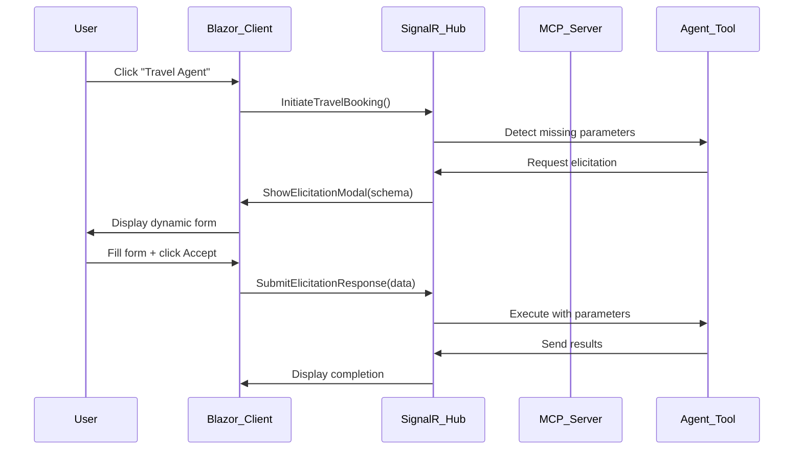

# .NET MCP Agent with Interactive Elicitation UI

A C# implementation of Model Context Protocol (MCP) agents with resumable HTTP server, simple event store capabilities, and **comprehensive interactive parameter elicitation** system.

## 🚀 NEW: MCP Elicitation UI with End-User Confirmation

This implementation now features a **complete MCP elicitation workflow** following the official Model Context Protocol specification for interactive parameter collection. Users can now interact with AI agents through **dynamic forms with validation**, providing parameters through an intuitive web interface with **accept/reject/cancel workflow**.

### 🎯 Key Elicitation Features

- **📋 Official MCP Specification Compliance**: Implements `elicitation/create` protocol with JSON Schema validation
- **🎨 Dynamic Form Generation**: Auto-generates UI forms from JSON Schema definitions
- **✅ Three-Action Workflow**: Complete accept/reject/cancel user confirmation system
- **⚡ Real-time Communication**: SignalR-powered instant interaction with zero page refreshes
- **🔒 Input Validation**: Schema-based validation with user-friendly error messages
- **📱 Responsive Design**: Modern Blazor WebAssembly interface that works on all devices
- **🎛️ Multi-Input Support**: Handles string, number, boolean, email, date, and enum field types

Ref:

- https://devblogs.microsoft.com/blog/can-you-build-agent2agent-communication-on-mcp-yes
- https://github.com/microsoft/ai-agents-for-beginners/tree/main/11-mcp/code_samples/mcp-agents
- [Model Context Protocol Elicitation Specification](https://modelcontextprotocol.io/docs/specification/2025-06-18/client/elicitation)

## Features

### Core MCP Capabilities
- **Resumable HTTP MCP Server**: Supports session resumption and message redelivery
- **SimpleEventStore**: Event store implementation for durability
- **Travel Agent**: Simulates travel booking with price confirmation via elicitation
- **Research Agent**: Performs research tasks with AI-assisted summaries via sampling
- **Real-time Progress Updates**: Streaming progress notifications
- **AI Assistance**: Sampling for complex decisions during execution
- **Google Gemini Integration**: AI-powered client using Google Gemini 1.5 Flash model

### 🆕 Interactive Elicitation System
- **MCP-compliant Parameter Collection**: Official elicitation/create protocol implementation
- **Dynamic Modal Interface**: Auto-generated forms based on JSON Schema definitions
- **User Confirmation Workflow**: Accept, reject, or cancel actions with proper validation
- **SignalR Real-time Updates**: Instant bi-directional communication without page refreshes
- **Schema-to-Form Conversion**: Automatic UI generation supporting multiple field types
- **Session Management**: Proper tracking of elicitation requests and responses

## Project Structure

```
├── src/
│   ├── McpAgent.Server/           # MCP Server implementation
│   ├── McpAgent.Client/           # MCP Client with Blazor UI
│   ├── McpAgent.XServer/          # Extended server with elicitation support
│   ├── McpAgent.XClient/          # Blazor WebAssembly client
│   ├── McpAgent.Core/             # Shared types and utilities
│   └── McpAgent.EventStore/       # Event store implementation
├── tests/
│   ├── McpAgent.Server.Tests/     # Server unit tests
│   ├── McpAgent.Client.Tests/     # Client unit tests
│   ├── McpAgent.Core.Tests/       # Core unit tests
│   └── McpAgent.Integration.Tests/ # Integration tests
└── samples/
    └── ConsoleApp/                # Sample console application
```

## Requirements

- .NET 8.0 or later
- ModelContextProtocol NuGet packages
- Modern web browser (for Blazor WebAssembly client)

## 🚀 Quick Start Guide

### 1. Running the Interactive Elicitation Server
```bash
cd src/McpAgent.XServer
dotnet run
```
The extended server runs on `https://localhost:5001` with SignalR hub at `/chatHub`.

### 2. Running the Blazor WebAssembly Client
```bash
cd src/McpAgent.XClient  
dotnet run
```
The interactive client runs on `https://localhost:5002` with full elicitation UI.

### 3. Experience Interactive Parameter Collection
1. Open browser to `https://localhost:5002`
2. Click "Travel Agent" or "Research Agent" buttons
3. **See the magic**: Dynamic forms appear for missing parameters
4. Fill out the auto-generated form with validation
5. Choose **Accept** (submit), **Reject** (decline), or **Cancel** (dismiss)
6. Watch real-time execution with your confirmed parameters

### 4. Traditional Server Options

#### Basic MCP Server
```bash
cd src/McpAgent.Server
dotnet run --port 8006
```

#### MCP Client (Console)
```bash
cd src/McpAgent.Client
dotnet run --url http://127.0.0.1:8006/mcp
```

#### Google Gemini AI Client
```bash
cd src/McpAgent.Client
dotnet run --gemini-enhanced --gemini-key YOUR_GEMINI_API_KEY --url http://127.0.0.1:8006/mcp
```

**Note**: To get a Google Gemini API key, visit https://ai.google.dev/gemini-api/docs/api-key

## 🎨 Interactive Elicitation UI Architecture

### MCP Elicitation Workflow

The implementation follows the **official Model Context Protocol elicitation specification** (`elicitation/create`) for interactive parameter collection:



### Key Implementation Components

#### 1. **MCP Elicitation Models** (`src/McpAgent.XServer/Models/`)
```csharp
public class McpElicitationRequest
{
    public string Message { get; set; } = string.Empty;
    public McpJsonSchema RequestedSchema { get; set; } = new();
}

public class McpElicitationResponse  
{
    public string Action { get; set; } = string.Empty; // "accept", "reject", "cancel"
    public Dictionary<string, object> Content { get; set; } = new();
}
```

#### 2. **SignalR Hub with Elicitation** (`src/McpAgent.XServer/Hubs/ChatHub.cs`)
```csharp
public async Task InitiateTravelBooking()
{
    // Detect missing parameters and trigger elicitation
    var elicitationRequest = await CreateElicitationRequest(missingParams);
    await Clients.Caller.SendAsync("ShowElicitationModal", elicitationRequest);
}

public async Task SubmitElicitationResponse(McpElicitationResponse response)
{
    if (response.Action == "accept")
    {
        // Execute tool with user-provided parameters
        await ExecuteToolWithParameters(response.Content);
    }
}
```

#### 3. **Dynamic Form Generation** (`src/McpAgent.XClient/Components/ElicitationModal.razor`)
- **JSON Schema → Form Conversion**: Automatically generates HTML forms based on MCP JSON Schema
- **Field Type Support**: String, number, boolean, email, date, enum with validation
- **Real-time Validation**: Client-side validation with user-friendly error messages
- **Three-Action UI**: Accept, Reject, Cancel buttons with proper state management

#### 4. **Schema-to-Field Mapping**
```csharp
private List<FieldInfo> ConvertSchemaToFields(McpJsonSchema schema)
{
    return schema.Properties.Select(prop => new FieldInfo
    {
        Name = prop.Key,
        Type = DetermineFieldType(prop.Value),
        Required = schema.Required?.Contains(prop.Key) ?? false,
        Description = prop.Value.Description,
        // ... validation rules
    }).ToList();
}
```

### Supported Field Types & Validation

| JSON Schema Type | UI Component | Validation |
|------------------|--------------|------------|
| `string` | Text input | Min/max length, pattern |
| `string` (format: email) | Email input | Email format validation |
| `string` (format: date) | Date picker | Date format validation |
| `number` | Number input | Min/max value validation |
| `boolean` | Checkbox | Boolean validation |
| `string` (enum) | Select dropdown | Enum option validation |

### User Experience Flow

1. **🎯 Agent Initiation**: User clicks "Travel Agent" or "Research Agent"
2. **🔍 Parameter Detection**: System analyzes tool requirements and detects missing parameters
3. **📋 Dynamic Form Generation**: Auto-generates form based on JSON Schema with validation rules
4. **✏️ User Interaction**: User fills form with real-time validation feedback
5. **✅ Three-Action Choice**: User can Accept (submit), Reject (decline), or Cancel (dismiss)
6. **⚡ Real-time Execution**: If accepted, tool executes immediately with provided parameters
7. **📊 Progress Updates**: Live progress updates via SignalR during tool execution

## Testing

Run all tests:

```bash
dotnet test
```

Test the elicitation workflow:
```bash
# Terminal 1: Start the extended server
cd src/McpAgent.XServer && dotnet run

# Terminal 2: Start the Blazor client  
cd src/McpAgent.XClient && dotnet run

# Browser: Navigate to https://localhost:5002
# Click "Travel Agent" -> Fill the modal form -> Accept -> Watch execution
```

## Architecture

This implementation follows the MCP specification with these key components:

1. **MCP Elicitation Protocol**: Official `elicitation/create` specification compliance
2. **Resumable HTTP Transport**: StreamableHTTP transport with session IDs and event replay
3. **Event Store**: Simple in-memory event store for session resumption  
4. **Agent Tools**: Travel and research agents demonstrating agentic behaviors
5. **Interactive Parameter Collection**: Real-time user input via dynamic forms
6. **Progress Notifications**: Real-time updates during long-running tasks
7. **SignalR Communication**: Bi-directional real-time updates without page refreshes
8. **Google Gemini Integration**: Direct HTTP API integration with Gemini 1.5 Flash model
9. **AI-Powered Execution**: Intelligent tool selection and natural language processing

### Elicitation vs Traditional Input

| Traditional Approach | MCP Elicitation Approach |
|---------------------|---------------------------|
| ❌ Static forms | ✅ Dynamic schema-based forms |
| ❌ Hard-coded parameters | ✅ Runtime parameter detection |
| ❌ No validation context | ✅ Rich JSON Schema validation |  
| ❌ Page refresh required | ✅ Real-time SignalR updates |
| ❌ Binary success/failure | ✅ Three-action workflow (accept/reject/cancel) |

### Gemini Client Features

The Google Gemini integration provides two modes:

- **Simple Mode** (`--gemini`): Direct AI-powered interaction with natural language understanding
- **Enhanced Mode** (`--gemini-enhanced`): Advanced features including:
  - Session management with persistent conversation history
  - Real-time notifications and progress tracking  
  - Interactive elicitation for user confirmations
  - AI-guided tool execution and decision making
  - Comprehensive logging and error handling

## 🎯 Real-World Use Cases

### Travel Booking Agent with Elicitation
```
User: "Book me a flight"
System: Detects missing parameters (destination, dates, budget)
User: Sees dynamic form with fields for destination, departure/return dates, budget
User: Fills form and clicks "Accept"  
System: Executes booking with confirmed parameters
```

### Research Agent with AI Sampling
```
User: "Research AI trends"
System: Detects missing research scope and depth
User: Completes elicitation form specifying topic focus and detail level
System: Uses AI sampling to summarize and analyze research results
```

### Configuration Wizard
```
User: "Setup new environment"
System: Dynamic form for environment type, features, security settings
User: Interactive confirmation of each configuration step
System: Applies settings with user validation at each step
```

## 🔧 Development & Customization

### Adding New Elicitation-Enabled Tools

1. **Define Tool Schema** in `McpAgent.XServer/Services/`:
```csharp
var schema = new McpJsonSchema
{
    Type = "object",
    Properties = new Dictionary<string, McpJsonSchemaProperty>
    {
        ["customParam"] = new() { Type = "string", Description = "Custom parameter" }
    },
    Required = new[] { "customParam" }
};
```

2. **Implement Parameter Detection**:
```csharp
public async Task<McpElicitationRequest> DetectMissingParameters(Dictionary<string, object> provided)
{
    var missing = schema.Required.Where(req => !provided.ContainsKey(req));
    if (missing.Any())
    {
        return new McpElicitationRequest
        {
            Message = "Please provide the required information:",
            RequestedSchema = CreateSchemaForMissing(missing)
        };
    }
    return null;
}
```

3. **Add SignalR Hub Method**:
```csharp
public async Task InitiateCustomTool()
{
    var elicitationRequest = await DetectMissingParameters(currentParams);
    if (elicitationRequest != null)
    {
        await Clients.Caller.SendAsync("ShowElicitationModal", elicitationRequest);
    }
}
```

### Extending Field Types

To add new JSON Schema field types to the UI:

1. **Update `FieldInfo` enum** in `Models/`:
```csharp
public enum FieldType { String, Number, Boolean, Email, Date, Enum, DateTime, Url, Color }
```

2. **Extend `DetermineFieldType` method**:
```csharp
private FieldType DetermineFieldType(McpJsonSchemaProperty property)
{
    return property.Format switch
    {
        "url" => FieldType.Url,
        "color" => FieldType.Color,
        "date-time" => FieldType.DateTime,
        // ... existing cases
    };
}
```

3. **Add UI Components** in `ElicitationModal.razor`:
```html
@case FieldType.Url:
    <input type="url" @bind="field.Value" class="form-control" />
    break;
```

## 📋 Implementation Checklist

- ✅ **MCP Elicitation Protocol**: Official specification compliance
- ✅ **Dynamic Form Generation**: JSON Schema to HTML form conversion  
- ✅ **Three-Action Workflow**: Accept/Reject/Cancel user responses
- ✅ **Real-time Communication**: SignalR bi-directional updates
- ✅ **Input Validation**: Client-side schema-based validation
- ✅ **Error Handling**: User-friendly error messages and recovery
- ✅ **Session Management**: Proper tracking of elicitation requests
- ✅ **Responsive Design**: Mobile-friendly Blazor WebAssembly UI
- ✅ **Multi-Field Support**: String, number, boolean, email, date, enum types
- ✅ **Progress Indicators**: Real-time tool execution feedback

## 🤝 Contributing

This project demonstrates a complete implementation of the **Model Context Protocol elicitation specification** with a modern .NET stack. Contributions are welcome for:

- Additional field types and validation rules
- Enhanced UI components and animations  
- More sophisticated agent tools
- Performance optimizations
- Additional MCP protocol features

## 📚 References

- [Model Context Protocol Specification](https://modelcontextprotocol.io/docs/specification/)
- [MCP Elicitation Documentation](https://modelcontextprotocol.io/docs/specification/2025-06-18/client/elicitation)
- [SignalR Documentation](https://docs.microsoft.com/en-us/aspnet/core/signalr/)
- [Blazor WebAssembly Guide](https://docs.microsoft.com/en-us/aspnet/core/blazor/)
- [JSON Schema Specification](https://json-schema.org/)

## License

MIT License
